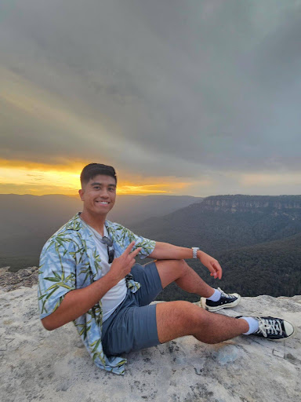

 

    

        
    

    

            <h3><b>Ren</b></h3>
            
<i>Clean the world, one Ren at a time</i>

    

 
<h1 align="center">Ren</h1>

**Ren: Clean the world, one Ren at a time**

Ren is dedicated to fostering community-led environmental conservation efforts. By organizing and participating in local clean-up events, we contribute to sustainable cities and communities, climate action, and the preservation of life below water and on land.

## Problem Statement

 
<blockquote align='center'>
<h3>

“In rapidly urbanizing communities, insufficient waste management practices and limited community involvement foster a mindset of neglect, contributing to the degradation of public spaces and adversely impacting the quality of life. This results in environmental pollution, compromised biodiversity, and heightened vulnerability to climate-related risks.”

</h3>
</blockquote>
 

## 🎥 Demo Video

> [Demo Video](https://youtu.be/mnYzlIxVN4I?si=hUYf9hVyakEn33Cr)
> [Google Slides](https://docs.google.com/presentation/d/1KD51l2Smz3Vg_TAuSgiEwv6Ur_HQJ-d1zIMmJcQMz-4/edit?usp=sharing)

## ⚙ Tech Stack

<iframe style="border: 1px solid rgba(0, 0, 0, 0.1);" width="800" height="450" src="https://www.figma.com/embed?embed_host=share&url=https%3A%2F%2Fwww.figma.com%2Ffile%2FOCN868Ksh00OMSRZJHpihg%2FArchitecture%3Ftype%3Ddesign%26mode%3Ddesign%26t%3DoONB37hW6k5lBAQy-1" allowfullscreen></iframe>

### Concept and Design

<iframe style="border: 1px solid rgba(0, 0, 0, 0.1);" width="800" height="450" src="https://www.figma.com/embed?embed_host=share&url=https%3A%2F%2Fwww.figma.com%2Ffile%2FsRJzesVDWOooZJEUlnqQRr%2FLow-and-High-Fidelity-Mockup%3Ftype%3Ddesign%26mode%3Ddesign%26t%3DoONB37hW6k5lBAQy-1" allowfullscreen></iframe>

## 🎯 UN's Sustainable Development Goals & Targets

    

        <ul>
            <li>11.4 - Strengthen efforts to protect and safeguard the world’s cultural and natural heritage.</li>
            <li>11.6 - By 2030, reduce the adverse per capita environmental impact of cities, including by paying special attention to air quality and municipal and other waste management.</li>
        </ul>
    

    

    

        <ul>
            <li>13.3 - Improve education, awareness-raising and human and institutional capacity on climate change mitigation, adaptation, impact reduction and early warning.</li>
        </ul>
    

    

    

        <ul>
            <li>14.1 - By 2025, prevent and significantly reduce marine pollution of all kinds, in particular from land-based activities, including marine debris and nutrient pollution.</li>
        </ul>
    

    

    

        <ul>
            <li>15.5 - Take urgent and significant action to reduce the degradation of natural habitats, halt the loss of biodiversity and, by 2020, protect and prevent the extinction of threatened species.</li>
        </ul>
    

    

## 👥 Team
|  |  |  |  |
| ---------------------------------------------------------------------------------------------------------------------------------------------------------------------------------------------------------------------------------- | ----------------------------------------------------------------------------------------------------------------------------------------------------------------------------------------------------------------------------------- | -------------------------------------------------------------------------------------------------------------------------------------------------------------------------------------------------------------------------- | ----------------------------------------------------------------------------------------------------------------------------------------------------------------------------------------------------------------------------- |
| 
<h3><b><a href="https://github.com/brightcosmo">Amirul Azizol</a></b></h3>
<i>Monash University</i>

                                                                               | 
<h3><b><a href="https://github.com/faw01">Faw Ali</a></b></h3></a>
<i>Monash University</i>

                                                                          | 
<h3><b><a href="https://github.com/Dhirennn">Mandhiren Singh</a></b></h3></a>
<i>Monash University</i>

</a>                                                               | 
<h3><b><a href="https://github.com/TongJetKit">Tong Jet Kit</a></b></h3></a>
<i>Monash University</i>

                                                                            |
